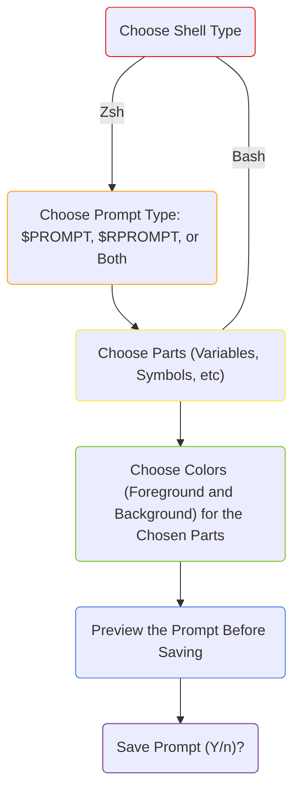

[](https://twitter.com/kyletimmermans)

# <div align="center">Shell-Color-Prompt-Tool</div>

Customize your Zsh/Bash terminal prompt with a menu-style selection guide. Choose what info you want the prompt to display (Username, Hostname, Symbols, etc), and their foreground and background colors! All from the command line. Use brighter colors for extra pop!

<div>&#8203;</div>

### Install as a Command - "scpt":
```bash
URL="https://github.com/kyletimmermans/shell-color-prompt-tool/releases/download/latest"; curl -q -s -LJO "$URL/shell-color-prompt-tool.sh" && chmod a+x shell-color-prompt-tool.sh && sudo mv shell-color-prompt-tool.sh /usr/local/bin/scpt && curl -q -s -LJO "$URL/scpt.1" && sudo mv scpt.1 /usr/local/share/man/man1/
```

<div>&#8203;</div>

### Temporary Use in Current Directory:
```bash
curl -q -s -LJO "https://github.com/kyletimmermans/shell-color-prompt-tool/releases/download/latest/shell-color-prompt-tool.sh" && chmod +x shell-color-prompt-tool.sh
```

<div>&#8203;</div>

#### Dependencies (For the --comment-out and --omz flags to work, if you choose to use them):

###### Linux (Debian-based)
```bash
sudo apt install -y gawk
```

###### MacOS (Homebrew)
```bash
brew install gawk gnu-sed
```

###### MacOS (MacPorts)
```bash
sudo port install gawk gsed
```

<div>&#8203;</div>

### Sample Program Walkthrough
<p align="center">
  
</p>

### Resulting Prompt
<p align="center">
  
</p>

<div align="center"><b>Note: I don't think anyone would create a prompt setup as chaotic as this one,
but I wanted to show off all of the different variables, symbols, colors and
how they're handled</b></div>

<div>&#8203;</div>

### Demo Video


### Demo Resulting Prompt

<p align="center">
  
</p>

<div>&#8203;</div>

### Program Flags

```text
-u, --usage, -h, --help      Show usage/help menu

-v, --version                Get program version. Reveal if a newer version is available on GitHub

--uninstall                  Undoes the "Install as a Command" installation option. It will delete
                             /usr/local/bin/scpt (program) and the associated man page

--comment-out                Comment out older prompt lines in .zshrc / .bashrc e.g. PROMPT= / PS1=
                             to help prevent conflicting prompt definitions

--omz                        Disables your 'Oh My Zsh' theme if you have one, which could get in
                             the way of applying your new prompt

--light-mode                 Better color contrast for the color picker menu on white / light-colored
                             terminal backgrounds

--no-extras                  Don't automatically add a newline to the start of the prompt
                             and a space to the end of the prompt

--separate-file              Place the prompt string in a separate file instead of putting it in
                             .zshrc / .bashrc for any reason E.g. --separate-file "~/test.txt"

--no-watermarks              Don't add the "# Added by Shell-Color-Prompt-Tool" comment to
                             .zshrc / .bashrc when adding the prompt string and don't add the
                             "# Commented out by Shell-Color-Prompt-Tool" comment when
                             using --comment-out or --omz
```

<div>&#8203;</div>

### Usage Notes
> [!NOTE]
> * #### You don't need to add a newline character at the beginning of your prompt for spacing between actual prompts, one will be added for you. Same with a space after the prompt so there's space between the prompt and inputted commands, one will automatically be added for you. This feature can be disabled with the --no-extras flag
> * #### If you want to use the --comment-out or --omz flags, you must have 'gawk' and 'gsed' installed. On Mac, you'll need to install both. On Linux, you just need gawk, as gsed should already be your default sed version
> * #### --comment-out and --omz can break the config if the variables that are getting commented out, are defined within things like if-statements or case-statements
> * #### For the actual prompt string in the .zshrc / .bashrc file, some text editors like Sublime Text will show the ANSI escape characters like "\e[0;30m" as "<0x1b>". Use a text editor like Vim to show the raw text
> * #### Fullscreen terminals will be able to fit the spacing and styling of the interactive prompt the best  
> * #### Colors may vary from system to system. When using the Custom RGB option, make sure your terminal supports TRUECOLOR (See [here](https://github.com/termstandard/colors))
> * #### If your command is too long, $RPROMPT will visually be temporarily overwritten
> * #### $RPROMPT cannot contain newlines (\n)
> * #### For more prompt expansion variables not listed in this program: [Zsh](https://zsh.sourceforge.io/Doc/Release/Prompt-Expansion.html) & [Bash](https://www.gnu.org/software/bash/manual/html_node/Controlling-the-Prompt.html)

<div>&#8203;</div>

### Reset Prompt Back to Default
| Don't like the prompt that got saved and want to change it back to its default? |
|---------------------------------------------------------------------------------|
|1. In your Terminal type: ```vi ~/.zshrc``` or ```vi ~/.bashrc```|
|2. Hit 'i' on your keyboard to start editing the file and remove the line(s) at the bottom of the file, e.g. "export PROMPT=etc" (Zsh) or "export PS1=etc" (Bash), that has the comment above it "# Added by Shell-Color-Prompt-Tool"|
|3. If you used --comment-out or --omz, uncomment your old prompt lines where the line above it says "# Commented out by Shell-Color-Prompt-Tool" |
|4. Hit 'escape (esc)' on your keyboard and then type ```:wq``` and hit enter|
|5. Back in your Terminal now, type ```source ~/.zshrc``` or ```source ~/.bashrc``` and hit enter|
|6. Restart your Terminal|
|7. Good as new!|

<div>&#8203;</div>

### Program Workflow



<div>&#8203;</div>

### Changelog
<div>v1.0: Initial-Relase</div>
<div>v1.1:</div>
<div>&ensp;&ensp;-Fixed issue where symbol choices misaligned with actual symbol output, found by @christiankuhtz</div>
<div>&ensp;&ensp;-Added period symbol to list of part choices</div>
<div>&ensp;&ensp;-Added --version and -v command line flag</div>
<div>&ensp;&ensp;-Fixed prompt spacing and wording</div>
<div>v2.0:</div>
<div>&ensp;&ensp;-Support for Bash added so its been changed from "Zsh-Color-Prompt-Tool" to "Shell-Color-Prompt-Tool"</div>
<div>&ensp;&ensp;-Added option to edit either a standard user prompt (PROMPT) or root prompt (RPROMPT), or both for Zsh</div>
<div>&ensp;&ensp;-Any added line(s) will have the comment above it, "Added by Zsh Color Prompt Tool" so the user knows which prompts were generated by the program</div>
<div>&ensp;&ensp;-Added --omz, --light-mode, --comment-out, and --no-extras flags</div>
<div>&ensp;&ensp;-Added more symbols and colors to chose from in the menus</div>
<div>&ensp;&ensp;-Added automatic newline to front of generated prompt and extra space to the end for cleaner prompt and terminal UX</div>
<div>&ensp;&ensp;-Messing up a color no longer makes you redo the foreground and background color, just the one that was incorrect</div>
<div>&ensp;&ensp;-Fixed issue where colors weren't properly escaped and could cause visual bugs</div>
<div>&ensp;&ensp;-Added: -h/--help & -u/--usage flags</div>
<div>v2.5:</div>
<div>&ensp;&ensp;-Added Custom RGB color option</div>
<div>&ensp;&ensp;-Fixed error messsages showing incorrect range of color options</div>
<div>&ensp;&ensp;-Updated and cleaned up help/usage flag output</div>
<div>v2.7:</div>
<div>&ensp;&ensp;-Force gawk usage, even on Linux, as there could be multiple awk types installed</div>
<div>&ensp;&ensp;-Removed OS-specific commands in --comment-out and --omz functionality</div>
<div>&ensp;&ensp;&ensp;&ensp;-Everything is using gawk and gsed now</div>
<div>&ensp;&ensp;-Fixed some wording in the --help menu</div>
<div>v3.0:</div>
<div>&ensp;&ensp;-Better logic for ensuring gawk & gsed usage when using --comment-out or --omz flags</div>
<div>&ensp;&ensp;-The version flag will show reveal whether an updated version of the tool is available</div>
<div>v3.1:</div>
<div>&ensp;&ensp;-Added error handling for version update check</div>
<div>v4.0:</div>
<div>&ensp;&ensp;-Fixed: RPROMPT means "Right Prompt" in Zsh, not "Root Prompt"</div>
<div>&ensp;&ensp;&ensp;&ensp;-Subsequently, you can now create a Zsh PROMPT and RPROMPT in one run</div>
<div>&ensp;&ensp;-Fixed: Multiple "Custom Text" options don't stick together anymore</div>
<div>&ensp;&ensp;-Fixed: Some Bash prompt expansion variables were not working properly</div>
<div>&ensp;&ensp;-Fixed: --comment-out / --omz logic bug that could break adding comments above added lines</div>
<div>&ensp;&ensp;-Added: "Other Zsh/Bash Prompt Expansion Variable" to parts menu / options</div>
<div>&ensp;&ensp;-Added: Newline to parts menu / options</div>
<div>&ensp;&ensp;&ensp;&ensp;-Can handle multiline prompts now</div>
<div>&ensp;&ensp;-Added: --separate-file flag</div>
<div>&ensp;&ensp;-Added: --no-watermarks flag</div>
<div>&ensp;&ensp;-Added: "Box Drawing" symbols to parts menu / options</div>
<div>&ensp;&ensp;-Added: "Arrows" symbols to parts menu / options</div>
<div>&ensp;&ensp;-Refactored and simplified file output logic section</div>
<div>&ensp;&ensp;-Refactored flag parsing - Now all parsing done in case statement</div>
<div>&ensp;&ensp;-Added more info and formatting to usage/help output</div>
<div>&ensp;&ensp;-General code cleanup: Removed redundant or unncessary code, wrapped code in functions</div>
<div>&ensp;&ensp;-Better prompt preview now that RPROMPT is printed on the right side of the terminal</div>
<div>&ensp;&ensp;-Log levels and coloring added to log statements</div>
<div>v4.1:</div>
<div>&ensp;&ensp;-Added: Traps to handle SIGINT/SIGTERM signals while program is running</div>
<div>&ensp;&ensp;-Added: --uninstall flag (Deletes scpt & man page)</div>
<div>&ensp;&ensp;-Refactor: Used [shellcheck.net](https://www.shellcheck.net/) linter - applied minor fixes</div>
<div>&ensp;&ensp;-Repo: Created man page</div>
<div>&ensp;&ensp;-Repo: Added screenshot automation / helper files to /media</div>

<div>&#8203;</div>

### Prompt Inspiration

Need inspiration and ideas for cool prompts? Check out this list!

#### <ins>Zsh:</ins>
* https://github.com/ohmyzsh/ohmyzsh/wiki/Themes
* https://github.com/romkatv/powerlevel10k


#### <ins>Bash</ins>:
* https://github.com/ohmybash/oh-my-bash/wiki/Themes
* https://github.com/win0err/aphrodite-terminal-theme

<div>&#8203;</div>

### FAQ

#### <ins>What’s the point of making this, hasn’t this been done already?</ins>
I've seen a few programs, mainly web-based ones, that help you to build out and customize shell prompts. I wanted to make
something that was native to the shell environment, no need to copy from the website and then needing to paste into your config
on the command line. I wanted it to be all in one place. There's a few other feaatures I wanted to see in a prompt customization
program as well:
- [x] Show the user all of the options they have for customizing their prompt, which includes all of the terminal variables (username, hostname, etc) and many of the colors available
- [x] Simple menu-style system for choosing which components and colors you'd like to be in the prompt
- [x] No need to edit the .bashrc / .zshrc file at all, no need to copy and paste the variable in there. The program will put it in there for you

<div>&#8203;</div>

#### <ins>Will you support other shells?</ins>
The plan is to potentially support other shells in the future. A big refactor would be needed to be able to support other ones.
Right now Zsh and Bash are the main shells that are supported, but if you put in an issue or even submit a PR, I can work with you to add support for another shell.

<div>&#8203;</div>

#### <ins>How do I get a multiline $RPROMPT like with Powerlevel10k or <i>{insert OhMyZsh theme here}</i>?</ins>
What themes like Powerlevel10k are doing to get the multiline RPROMPT effect, is using a print statement
that runs every time, just before the PROMPT and RPROMPT are drawn. The extra line is not actually a part of
the $RPROMPT variable, it just appears to be with some clever programming. [romkatv](https://github.com/romkatv),
who created Powerlevel10k, has a code snippet [here](https://gist.github.com/romkatv/2a107ef9314f0d5f76563725b42f7cab)
that explains how its done.

<div>&#8203;</div>

#### <ins>Does this project have anything to do with AppleScript and its .scpt files?</ins>
Nope! I realized too late after naming this project that .scpt files existed.
